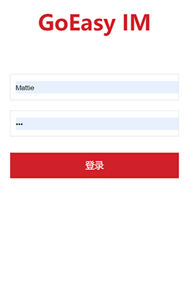
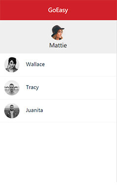

# 手把手教你用GoEasy实现Websocket IM聊天       
本文会持续更新，最新版本请访问https://github.com/GoEasySupport/goeasy-chat-demo    

经常有朋友问起GoEasy如何实现IM，今天就手把手的带大家从头到尾用GoEasy实现一个完整IM聊天，全套代码已经放在了github。    
  

作为一名程序员，在编码之前，首先要做的当然是架构设计！什么？确认不是装逼？当然，别忘了星爷的那句话：我是一名程序员！没有思想的程序员，跟咸鱼有什么区别呢？   

咳咳咳，正文开始：

**首先我们代码层将整个功能分为四层：**

1. 华丽的展示层（index.html）：你们负责功能优雅强大，我负责貌美如花。展示层其实就是纯静态的html，显示界面，高端点说，就是负责人机交互的。
2. 承上启下的控制层（controller.js）:  控制层作用就是接受页面操作的参数，调用service层，根据页面的操作指令或者service层的反馈，负责对页面的展示做出控制。不可以编写任何与展示逻辑无关的代码，也就是不能侵入任何业务逻辑。衡量这一层做的好不好的的标准，就是假设删掉controller和view层，service能准确完整的描述所有的业务逻辑。
3. 运筹帷幄的关键核心业务层（service.js）: 接受controller层的指令，实现业务逻辑，必要时候调用goeasy提供网络通讯支持，或调用restapi层完成数据的查询和保存。这一层包含所有的业务逻辑，任何业务逻辑相关的代码，都不可以漏到其他层，确保只要service存在，整个项目的灵魂就存在，确保service层完全是原生代码实现业务逻辑，而没有类似于vue或者小程序前端框架的语法和代码渗入，从而达到service层能够在任何前端框架通用。
4. 神通广大的服务器交互层（restapi.js）: 根据传入的参数完成服务器端接口的调用，来实现数据查询或、修改或保存，并且返回结果，不参与任何业务逻辑。在实践中大部分是负责发送http请求和服务器交互。

分层的目标就是为了确保除了在核心业务层以外的其他层次能够被轻易的替换。举例：我们当前的版本是使用html+jquery完成，如果希望再开发一个Uniapp实现的小程序或者app，只需要用Uniapp画个新外壳，对controller层做一些修改，就可轻松完成一个小程序或者APP版的IM聊天，不需要对service和restapi做任何修改 。同理，如果服务器端发生变化，或者更换了与服务器的交互方式，只需要对restapi做出修改，其他三层则不受任何影响。

OK, 有了如此清晰而优秀的代码结构分层设计，就差一段优雅的代码来实现了。

**Ready, Go! 编码开始：**
1. **登录页面**，这个最简单，闭着眼睛画个界面，用户名密码正确后，完成以下几个步骤。    
1.1. 根据用户名查询出来的用户，初始化全局变量：当前用户。  
1.2. 将controller层的onNewMessage, onFriendOnline，onFriendOffline赋值给service 。   
1.3. new goeasy建立长连接，记得要传入userid。如需在subscriberPrencese用户上下线提醒事件，或者在调用HereNow获取在线用户列表时，能拿到userId以外，更多的信息，可以在userdata里传入。     
1.4. 调用restapi，查询该用户的好友列表，根据结果初始化本地好友列表friendlist。  
1.5. 循环好友，以friendUUID为channel，调用subscriberPrencense，监听所有好友的上下线事件。    
1.6. 以当前用户的uuid为channel，调用subscriber，监听来自所有好友发来的消息。     
1.7. 显示好友列表界面。       
1.8. 初始化好友的在线状态，以数组形式传入所有好友的userId，调用hereNowByUserIds，获得当前在线的好友列表，根据结果将friendlist里属于在线状态的friend的在线状态改为true，同时将界面上在线用户的头像改为彩色。
2. **显示好友列表**（1.7）      
2.1. service层获取当前用户信息，在页面显示当前用户的username和头像。        
2.2. service获取本地好友列表，然后controller将每个好友的头像和名称显示到页面上，对于当前在线的用户，旁边显示一个小绿点，如果该好友有未读消息的，红色小气泡显示未读消息数量，并且为每个好友绑定一个点击事件，点击好友时，显示聊天界面。
3. **点击一个好友，进入与其聊天的界面**     
3.1. 窗口顶部显示聊天好友的名称。     
3.2. 调用restapi根据当前用户的UUID和好友的friendUUID，查询与该好友的聊天记录，如果这个聊天记录的sender是自己，就显示在页面的右边，如果是朋友发的，则显示在左边。        
3.3. 将该好友在本地数据里未读消息恢复为0。        
3.4. 并且将聊天记录滚动到最下边。     
3.5. 如果点击返回，就直接调进入第二步。
4. **在聊天界面，输入消息后发送：**   
4.1. 当前用户uuid作为senderUUID和消息内容组成chatMessage。        
4.2. 调用restapi将chatMessage发往“服务器”端，我们建议的方式是所有的消息发往自己的服务器端，在服务器端先保存入库，然后在服务端publish. 具体做法是将chatMessage转换为字符串，入库，然后将该好友的channel作为channel调用GoEasy完成publish。(当然，你会发现在我们的示例代码这个过程是在restapi里直接完成的，原因是为了demo的演示方便，我们模拟的服务器端行为，相信你懂的）       
4.3. 自己的消息发送成功后，显示在聊天窗口的右边。
5. **收到新消息：**       
5.1. 在1.6定义了接收好友新消息的事件，当收到一条好友的新消息时。        
5.2. 首先调用restapi保存到服务器。     
5.3. 本地好友数据里的未读消息加1。        
5.4. 如果当前界面是好友列表，将来自该朋友的未读消息的数字显示在界面上。      
5.5. 如果收到的消息就是来自当前对话窗口，就将消息显示到聊天窗口，并且调用service将本地数据里该好友的未读消息清0。
6. **用户上下线提醒**      
6.1. 在1.5监听了用户上下线，当收到一个用户上线或下线的通知后（注意返回的是一个列表，一次事件有可能有多个好友都发生了状态变化）。        
6.2. 修改将本地数据里该好友对象在线状态,如果是上线事件就显示彩色，如果是下线就显示黑白色。

至此，整个聊天功能就完成了，是不是很简单呢。在整个demo中只用到了goeasy的四个API
subscriber（接收消息），subscriberPrencense（接受上下线通知），hereNowByUserIds(获取当前在线用户列表）, publish(发送消息)，详情可以参考goeasy官方文档：https://www.goeasy.io/cn/developers.html

哼！这难道不是纸上谈兵吗？Talk is cheap, show me the code! 优雅的代码在哪里呢？

别着急，当然有全套代码拉，如果放个zip文件的下载连接，显得B格太低，老规矩，github见: https://github.com/GoEasySupport/goeasy-chat-demo       

**注意事项：**       
1. 在restapi.js 里 可以找到用户名和密码     
2. appkey要换成您自己的common key      
3. subscriberPrencense和hereNowByUserIds这两个方法，默认是关闭的，需要扫码添加GoEasy客服开通哦~      

将代码与本文一起对照阅读后，要写个IM，比画个0还简单，如果使用的是其他的前端技术框架如小程序和Reactnative，只需要重新画个外壳就好了！什么,你不相信？如果觉得你被骗了，请扫码添加微信好友，欢迎吐槽！没有您暴风雨般的吐槽和春风一般的赞美，我如何进步呢？      
    

**彩弹在最后：**  
看了代码的你，是不是发现我们的RESTAPI其实是个冒牌货，并不会真的和远程的某个服务器交互，这是为了方便演示，我们定义了两个变量来帮助模拟远程数据的查询，然后用localstorage来模拟服务器的保存，相信聪明的你，肯定已经get到我们的代码思路了。

 